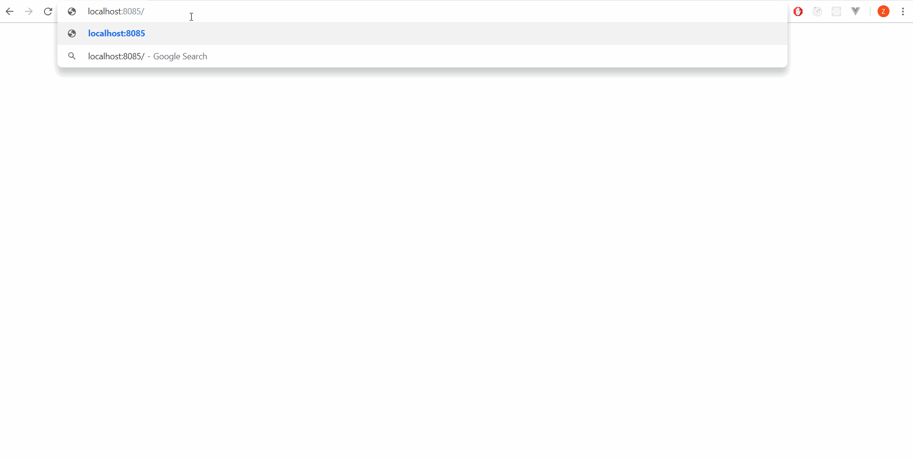

# Type-safe documentation

Fable.Remoting allows for automatically building a documentation page generated from the API definition that can be enriched with examples and descriptions of the various remote functions, similar to Swagger UI. Let us demonstrate this with an example starting from scratch, given the following types:
```fs
type Student = {
    name: string
    age: int
    subjects: string []  
}

type IStudentApi =
    { allStudents : Async<Student list>
      findByName : string -> Async<Student option> }
```
Now we can build an implementation on the server:
```fs
let students() = [
    { name = "Alice"; age = 20; subjects = [| "math" |]  }
    { name = "Martin"; age = 19; subjects = [| "cs" |]  }
]

let studentApi : IStudentApi = {
    allStudents = async { return students() }
    findByName = fun name -> async {
        let foundStudent = 
            students()
            |> List.tryFind (fun student -> student.name = name)
        
        return foundStudent  
    }
}
```
We can expose the API as a web service as usual
```fs
let webApp : HttpHandler =
    Remoting.createApi()
    |> Remoting.fromValue studentApi
    |> Remoting.buildHttpHandler
```
This is the standard setup of exposing an API, now we can add documentations like as follows:
```fs
// Create docs builder
let docs = Docs.createFor<IStudentApi>()

// Setup docs content
let studentApiDocs = 
    // create examples for different routes using the builder
    Remoting.documentation "Student Api" [

        docs.route <@ fun api -> api.allStudents @>
        |> docs.alias "Get All Students"
        |> docs.description "Returns a list of all students"
        
        docs.route <@ fun api -> api.findByName @> 
        |> docs.alias "Find By Name"
        |> docs.description "Searches for a student by the provided name"
        |> docs.example <@ fun api -> api.findByName "Alice" @>
        |> docs.example <@ fun api -> api.findByName "Unknown" @>         
    ]

let webApp =
    Remoting.createApi()    
    |> Remoting.fromValue studentApi
    |> Remoting.withDocs "/api/students/docs" studentApiDocs
    |> Remoting.buildHttpHandler
```
With this setup in place, the generated documentation page is exposed at the url `/api/students/docs` and it is enriched with the descriptions and examples, let us look at this live:



This allows us to quickly and easily document our remote functions, completely in a type-safe manner.  